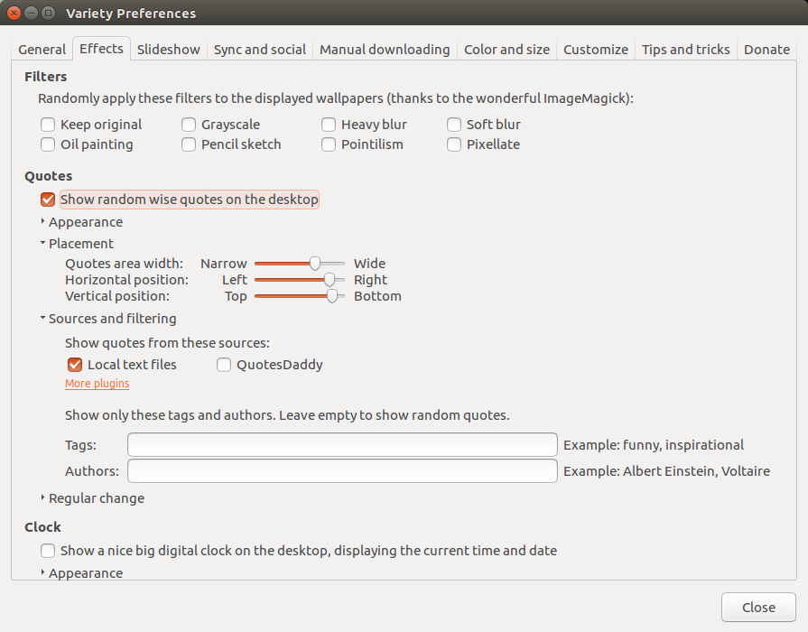

# variety bible text

To be used for displaying random verses on linux computer that supports the variety application

## How to use
Install variety from the terminal 

```bash
$ sudo add-apt-repository ppa:peterlevi/ppa
$ sudo apt-get update
$ sudo apt-get install variety
```

> Please don't copy the `$` symbol as it just represents the terminal/prompt (I am using the Ubuntu package manager in this case, you might have to google your own linux version of package manager and how to install variety)

After variety has been installed, copy the bible text of your choice into the `~/.config/variety/pluginconfig/quotes` folder. 

Reopen variety and go to the `effects` tab and check the `show random wise quotes on the desktop` check box


